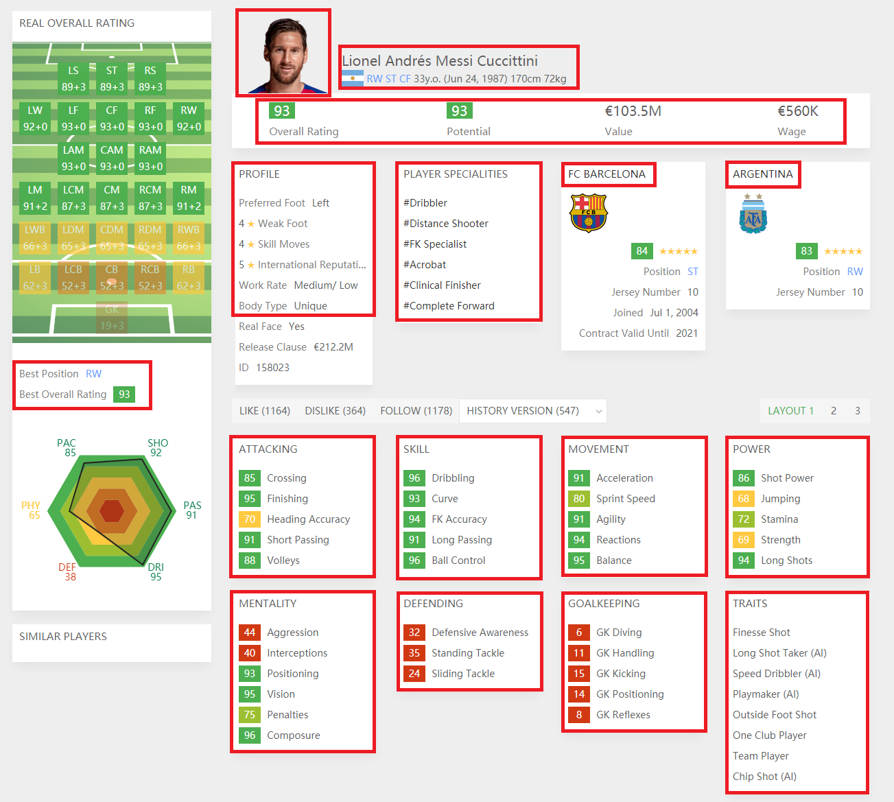
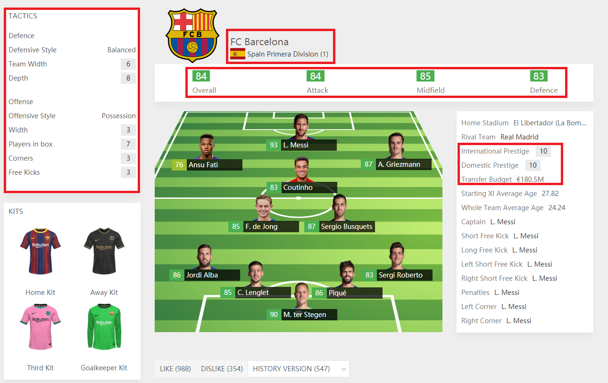

# FIFA 21 Rating Crawler

This repository contains FIFA 2021 Player &amp; Team ratings scraped from web.

## Dataset Content
 - 19.002 player information  
 - 56 player attribute  
 - 16.630 player image  

 - 681 team  
 - 17 team attribute  

The red squares indicate that specified information has been scraped. 

### TODOs ###
 - Error handling
 - Comment / documentation
 - Beautify README.md
 
### What can you do with this dataset? - Ideas (next step) ###
 - General EDA
#### About Players ####
 - Visualize player's position(s)
 - Predict player's all overall rating for every position (ST = 92, CAM = 84 etc.)
 - Predict player's value
 - Get most similar 11 (based on images)
 - Generate *perfect player* for given position (combine best 10? player's faces)
 - and more...
 
#### About Teams ####
 - Which team will most likely win the game X vs Y?
 - What is best possible tactic for team X? (should implement classic tactics such as 4-4-2, 4-3-3 etc.)
 - Who should you transfer for team X? (using team's player ratings + transfer budget)
 - and more...
 
### Acknowledgements ###
The data has been crawled from the https://sofifa.com website.